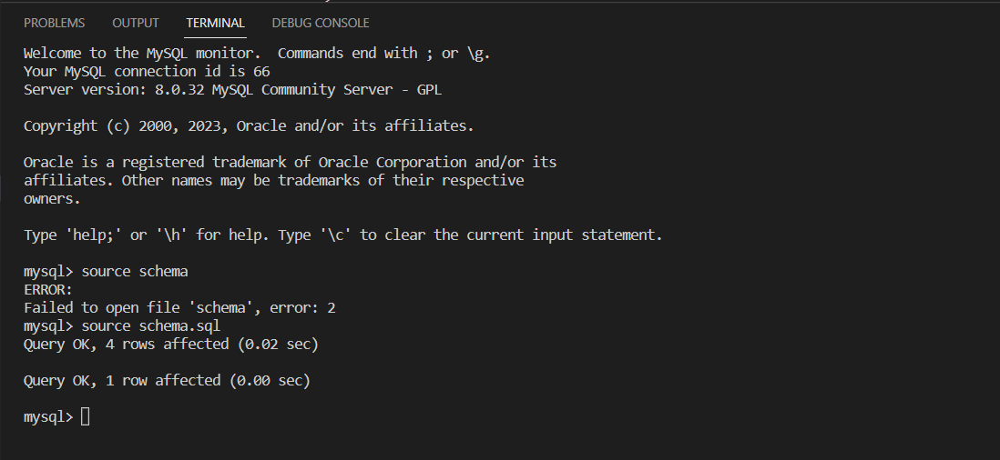
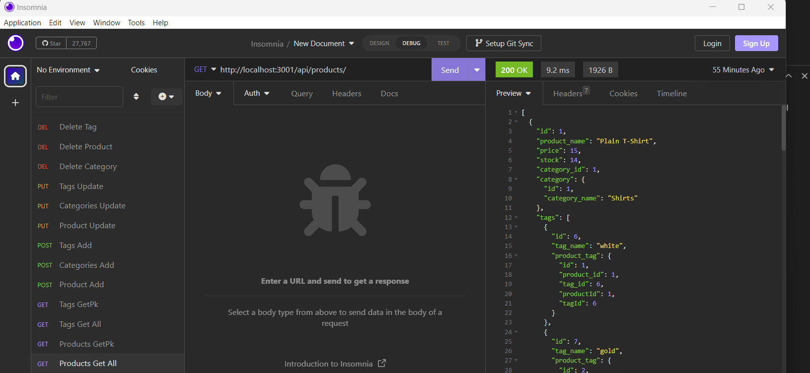

# E-commerce Back End Starter Code

# Description
This is an e-commerce site that allows the user to add products, categories, and tags; delete products, categories, and tags; update products, categories, and tags; view all products, categories, and tags; and view one product, category, or tag (by its primary key).

How this project works:

[View video](../Ecommerce.webm)

First, we use MySql to set up the schema: 

[]

Then, seed the database:

[]

Then, turn on the server:

[]

Adding a category:

[]

Adding a product:

[]

Adding a tag:

[]

Viewing all categories:

[]

Viewing all products:

[]

Viewing all tags:

[]

Delete a category:

[]

Delete a product:

[]

Delete a tag:

[]

View one category:

[]

View one product:

[]

View one tag:

[]

## Skills learned

I practiced Express.js, Sequelize, MySQL, and Insomnia

